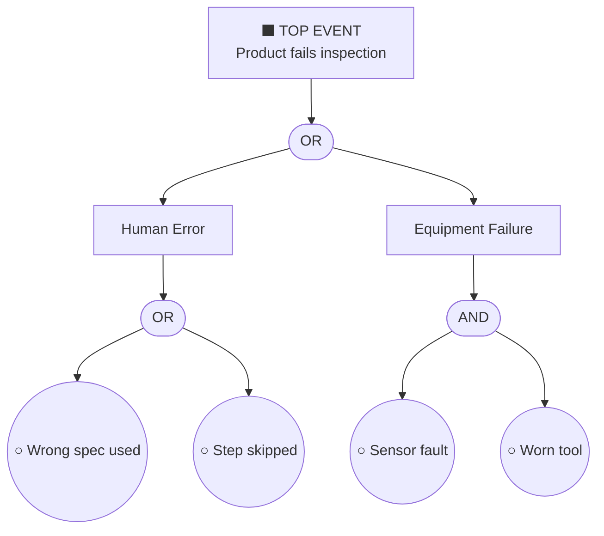

# Fault Tree Analysis (FTA) in Quality Control

Guide the user through creating a Fault Tree Analysis for a quality control scenario. Follow these steps:

## 1. Define the Top-Level Event (Undesired Outcome)
Ask the user what failure or quality defect they want to analyze. Examples:
- Product fails final inspection
- Machine produces out-of-spec parts
- Customer complaint received

State the top event clearly as a box at the top of the tree.

## 2. Identify Immediate Causes (Level 1 Gates)
Break the top event into its direct causes using logic gates:
- **OR gate** (∨): The top event occurs if *any* of the causes occur
- **AND gate** (∧): The top event occurs only if *all* causes occur simultaneously

Typical Level 1 categories for quality control:
- Human error
- Equipment/machine failure
- Material defect
- Process deviation
- Environmental factor

## 3. Decompose Each Cause (Level 2 and Beyond)
For each cause at Level 1, repeat the decomposition:
- Ask: "What could cause this?"
- Apply OR/AND gates as appropriate
- Continue until you reach **basic events** (root causes that need no further breakdown)

Mark basic events with a circle (○).

## 4. Assign Probabilities (Optional but Recommended)
For each basic event, estimate or look up:
- Failure rate (e.g., failures per hour, per batch)
- Probability of occurrence in a given period

Propagate probabilities up the tree:
- **OR gate**: P(output) = 1 − ∏(1 − Pᵢ) for independent events
- **AND gate**: P(output) = ∏ Pᵢ

## 5. Draw the Tree
Produce a text-based or Mermaid diagram representation. Example structure:

```
[Top Event: Product fails inspection]
        |
       OR
   /        \
[Human      [Equipment
 Error]       Failure]
   |              |
  OR             AND
 /   \          /    \
[Wrong [Skipped [Sensor [Worn
 spec]  step]  fault]  tool]
```

Or as a Mermaid flowchart (top-down):



## 6. Identify Critical Paths (Minimal Cut Sets)
Find the smallest combination of basic events that can cause the top event. These are the highest-priority risks to mitigate.

## 7. Recommend Corrective Actions
For each critical basic event or cut set, suggest:
- **Prevention**: eliminate the root cause (e.g., poka-yoke, maintenance schedule)
- **Detection**: add checks to catch the failure early (e.g., SPC, in-line sensors)
- **Mitigation**: reduce impact if the failure occurs (e.g., quarantine procedure)

## 8. Document the Analysis
Summarize results in a table:

| Basic Event | Gate Path | Probability | Priority | Action |
|-------------|-----------|-------------|----------|--------|
| Wrong spec used | OR → OR | 0.05 | High | Controlled document system |
| Sensor fault | OR → AND | 0.02 | Medium | Preventive maintenance |

---

After completing the analysis, ask the user if they want to:
- Export the tree as a Mermaid diagram in a `.md` file
- Calculate overall top-event probability from their input data
- Identify which ISO 9001 or IATF 16949 clauses relate to each root cause
